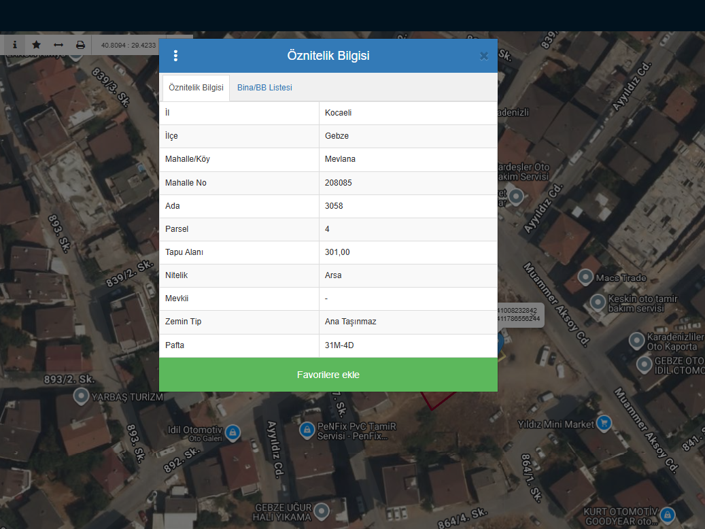
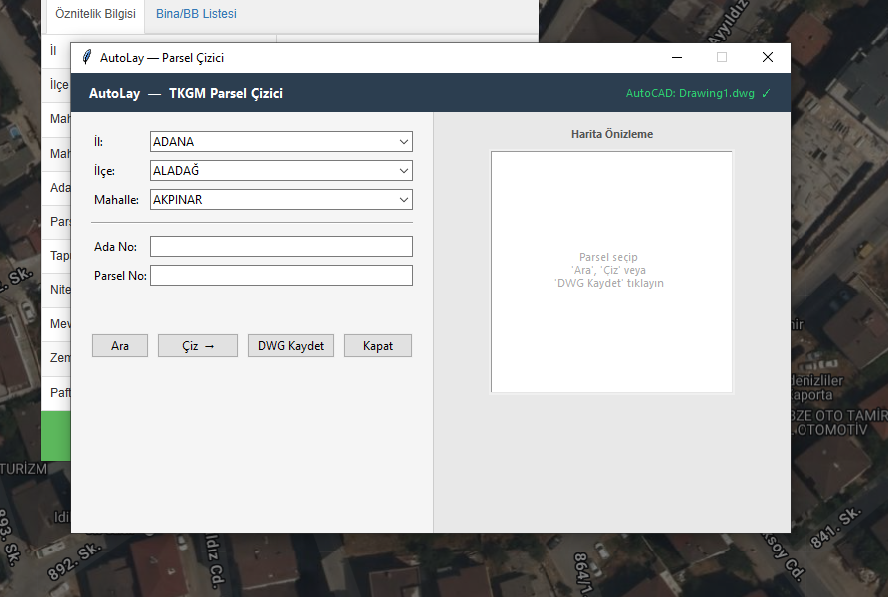
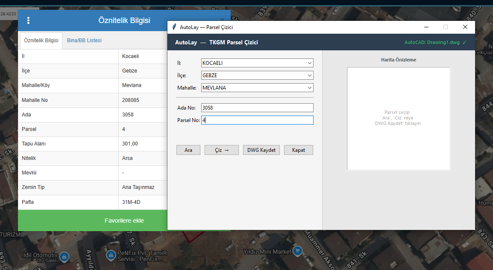
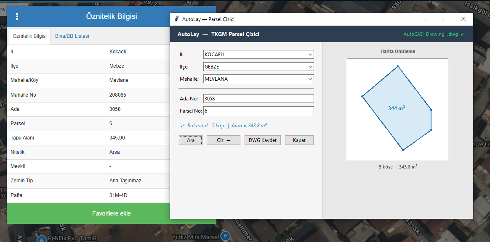
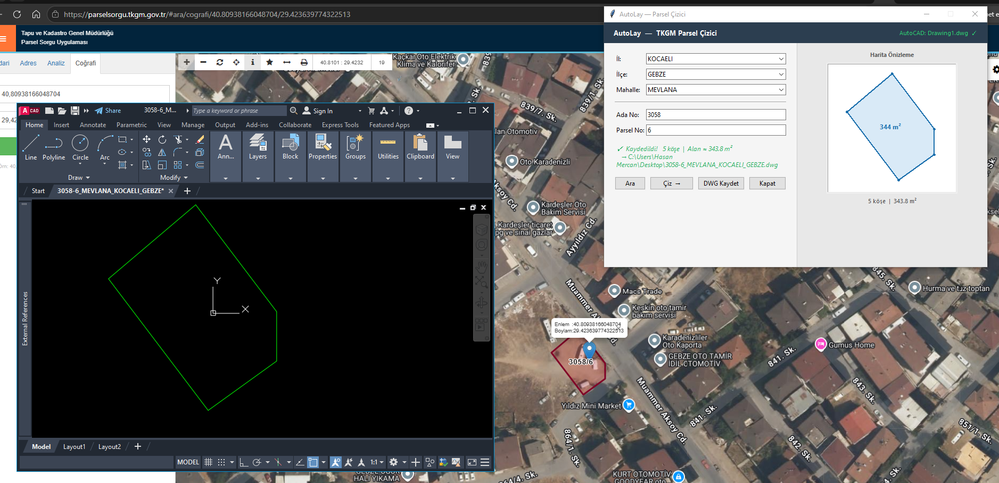

# AutoLay

AutoLay, AutoCAD'e bağlanarak TKGM CBS API'sinden otomatik parsel koordinatı çeken ve çizim yapan modern bir Python uygulamasıdır. İmar hesapları, çekme mesafeleri ve mimari analizler için güçlü bir altyapı sunar.

---

## Proje Özellikleri

- **TKGM CBS API** ile il/ilçe/mahalle/ada/parsel bilgisinden arsa koordinatlarını çeker
- **AutoCAD 2026** ile doğrudan bağlantı kurar, parseli LWPolyline olarak çizer
- **Kapsamlı GUI**: Tkinter tabanlı kullanıcı dostu arayüz
- **İmar Hesapları**: TAKS/KAKS, çekme mesafeleri, emsal harici alanlar
- **Modüler Mimari**: Kolayca geliştirilebilir ve test edilebilir yapı

---

## Tanıtım Görselleri

### 1. Başlangıç Ekranı

Kullanıcı, uygulamanın ana ekranında temel seçenekleri görebilir.

### 2. Parsel Seçimi

Parsel seçimi yapılarak işleme başlanır.

### 3. Parametre Girişi

Gerekli parametreler kullanıcı tarafından girilir.

### 4. Sonuçların Görüntülenmesi

Hesaplama sonrası sonuçlar ekranda gösterilir.

### 5. Çizim ve Rapor

Oluşturulan çizim ve raporlar kullanıcıya sunulur.

---

## Gereksinimler

- Python 3.10+
- AutoCAD 2026
- Windows

---

## Kurulum

```bash
git clone https://github.com/Hasanmercann/autolay.git
cd autolay
python -m venv venv
venv\Scripts\activate
pip install pywin32 requests playwright
playwright install chromium
```

---

## Kullanım

```bash
python -m autolay
```

AutoCAD açık olmalı. Pencerede il, ilçe, mahalle, ada ve parsel bilgileri seçilip girildikten sonra parsel AutoCAD'e çizilir.

### Sadece TKGM sorgusu

```python
from autolay.tkgm import TKGMOkuyucu

ok = TKGMOkuyucu()
sonuc = ok.parsel_sorgula("KONYA", "ILGIN", "TEKELER", "175", "1")
print(sonuc.koseler)
print(sonuc.alan_m2)
```

### Yeni il eklemek

```bash
python autolay/tkgm/id_olustur.py ANKARA
python autolay/tkgm/id_olustur.py ISTANBUL
python autolay/tkgm/id_olustur_tumtur.py
python autolay/tkgm/id_olustur_tumtur.py --eksik
```

---

## Klasör Yapısı

```text
autolay/
├── core/        AutoCAD bağlantısı ve hata sınıfları
├── cizim/       Çizim araçları ve katman yönetimi
├── tkgm/        TKGM sorgu, önbellek ve çizim akışı
├── gui/         Tkinter arayüzü
├── mimari/      İmar ve çekme hesapları
├── utils/       Yardımcı modüller
└── config/      Sabitler
tests/           Test dosyaları
docs/            Dokümantasyon ve tanıtım görselleri
```

---

## Kodun Temel Bileşenleri

### AutoCAD Bağlantısı
- `autolay/core/baglanti.py` içindeki `AutoCADConnector`, COM üzerinden AutoCAD uygulamasına bağlanır, aktif çizimi ve model uzayını doğrular.

### Katman Yönetimi
- `autolay/cizim/layers.py` içindeki `LayerManager`, katman oluşturma, etkinleştirme, renk atama ve katman kontrolü işlemlerini yürütür.

### Geometrik Çizim
- `autolay/cizim/shapes.py` içindeki `GeometryDrawer`, çizgi, kare, dikdörtgen, daire ve poligon gibi temel geometrileri AutoCAD'e yazar.

### TKGM Parsel Okuma
- `autolay/tkgm/okuyucu.py` içindeki `TKGMOkuyucu`, mahalle ID önbelleğini kullanır, CBS API'den veriyi çeker ve koordinatları işleyip parsel sonucuna dönüştürür.

### İmar Hesapları
- `autolay/mimari/imar_hesap.py` içindeki `ImarHesap`, TAKS, KAKS, emsal harici alan, toplam inşaat alanı ve uyarı raporlarını üretir.

---

## Testler

```bash
python tests/test_tkgm.py
python tests/test_tkgm_autocad.py
python tests/test_geometri.py
```

---

## Dokümantasyon

- `docs/gunluk.md`: geliştirme günlüğü
- `docs/gelecek_ozellikler.md`: planlanan özellikler

---

## Katkı

Katkı göndermek için fork alıp değişikliklerinizi ayrı bir dalda hazırlayabilir ve pull request açabilirsiniz.
